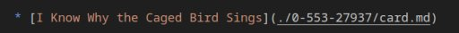

# library

A collection of media recommended, planned, in progress, or completed by me.

## [Books](./books/catalog.md)

For the books that have been read, I am using the actual identifying "section(s)" from their ISBN-10/ISBN-13 identifiers, excluding any ISBN-13 978/979 prefixes and dropping the check digit from either -10 or -13:

## [CDs] (yes, I have CDs!)

I just have not enumerated them here yet.
