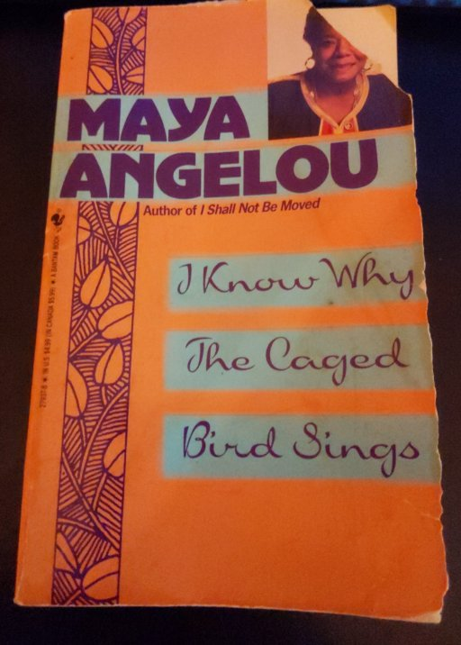
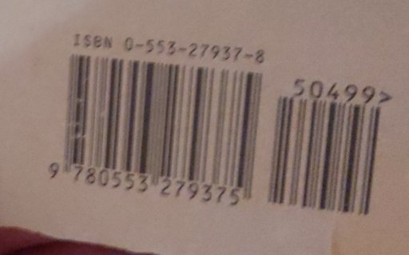
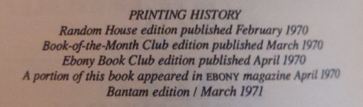
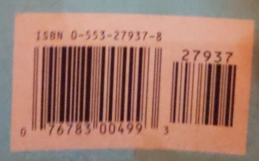

## Author: Maya Angelou

## Cover

## ISBN-23 (10+13)

* ISBN-10: 0-553-27937-8
* ISBN-13: 9-780553-279375

Not quite sure what the `50499>` is for yet.

## Publisher: Bantam Books

### Edition: 1971+ (?)

I am unable to find the specific edition of _this_ printing.

#### Printing History

There is a `Printing History` note in the beginning pages of the book:

The last entry in the  notes at the beginning of the book indicate a March 1971 printing.

Given the entry is part of a "history", I am assuming it is not _this_ printing.

But then again, maybe I missed something in Book Classifications 101 during college, or maybe I am just stupid and missed it entirely. I am trying to become smarter, thus I am reading.

#### Different Codes

The barcode(s) on the inside cover (where the ISBNs are pictured) are different from that on the back of the book:

* (UPC?): 0-76783-00499-3 + 27937

So it's not quite a UPC (it does scan as one), but the the additional 27937 code is not picked up.

Come to think of it, neither was the `50499` as seen in the image in the ISB-23 section. &#x1F914;

Could be related to the "mass market paperback" style of publication?
